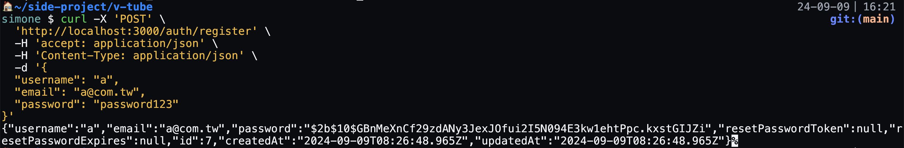
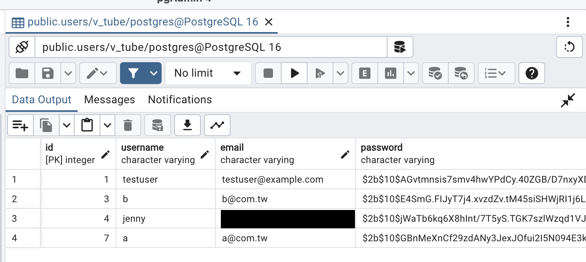
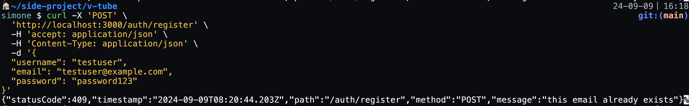
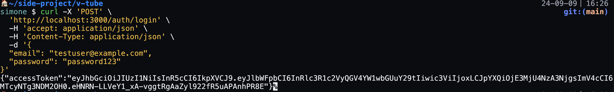
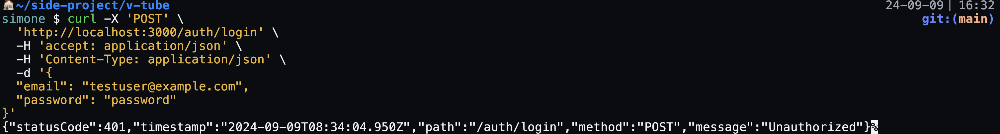

## Installation

```bash
$ pnpm install
```

## Setting .env File

Example:

```
DB_HOST=localhost
DB_PORT=5566
DB_USERNAME=your_username
DB_PASSWORD=your_password
DB_NAME=v_tube
DB_SYNCHRONIZE=false
JWT_SECRET=your_jwt_secret
EMAIL_HOST=your_email_host
EMAIL_PORT=your_email_port
EMAIL_USER=your_email_user
EMAIL_PASS=your_email_pass
FRONTEND_URL=your_frontend_url
```

## Running the app

```bash
# development
$ pnpm run start

# watch mode
$ pnpm run start:dev

# production mode
$ pnpm run start:prod
```

## Test

```bash
# unit tests
$ pnpm run test

# e2e tests
$ pnpm run test:e2e

# test coverage
$ pnpm run test:cov
```

## Features

### Register

Success:



註冊成功後資料庫會出現一筆 user 資料：



Fail:



### Login

Success:



Fail:


